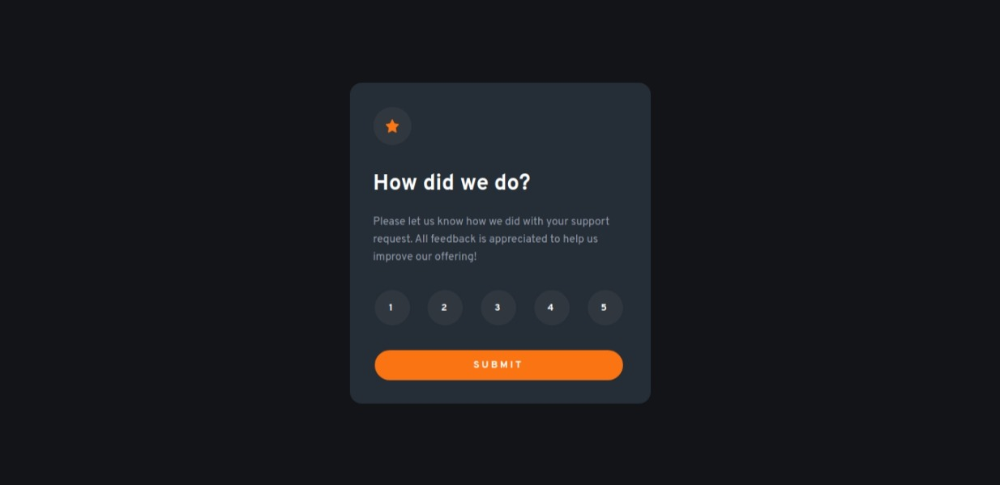
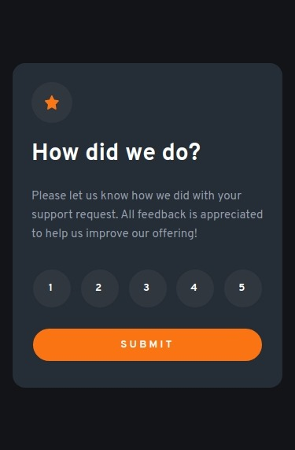

# Frontend Mentor - Interactive rating component solution


This is a solution to the [Interactive rating component challenge on Frontend Mentor](https://www.frontendmentor.io/challenges/interactive-rating-component-koxpeBUmI). Frontend Mentor challenges help you improve your coding skills by building realistic projects. 

## Table of contents

- [Overview](#overview)
  - [Screenshot](#screenshot)
  - [Links](#links)
- [My process](#my-process)
  - [Built with](#built-with)
  - [What I learned](#what-i-learned)
  - [Continued development](#continued-development)
  - [Useful resources](#useful-resources)
- [Author](#author)
- [Acknowledgments](#acknowledgments)

**Note: Delete this note and update the table of contents based on what sections you keep.**

## Overview

### Screenshot






### Links

- Live Site URL: [Add live site URL here](https://ebert-diaz.github.io/qr-code-component/)

## My process

### Built with

- Semantic HTML5 markup
- CSS custom properties


### What I learned


```css
/* Forma de centrar un div */
.Center-div-css {
  margin: 20px auto 20px auto;
}

/* Cómo anclar un DIV al pie de una página */
footer {
  width: 100%;
	position:absolute;
	bottom:0;
}

```

If you want more help with writing markdown, we'd recommend checking out [The Markdown Guide](https://www.markdownguide.org/) to learn more.

**Note: Delete this note and the content within this section and replace with your own learnings.**


## Author

- Frontend Mentor - [@Ebert-03](https://www.frontendmentor.io/profile/Ebert-03)


# Project setup
```
pnpm install
```

### Compiles and hot-reloads for development
```
pnpm run serve
```

### Compiles and minifies for production
```
pnpm run build
```

### Lints and fixes files
```
pnpm run lint
```

### Customize configuration
See [Configuration Reference](https://cli.vuejs.org/config/).
